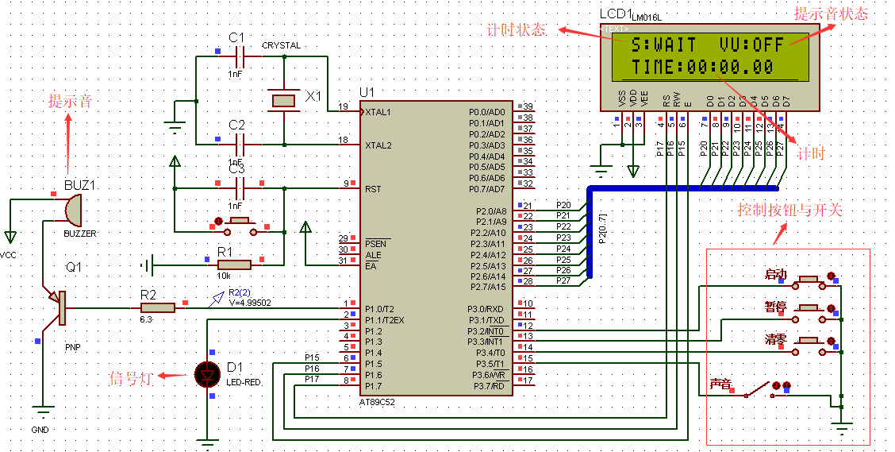

## 项目封面

## 项目介绍

- 项目名称：秒表系统
- 项目介绍：该项目所用的芯片为AT89C52,开发语言为C语言，为一个精度为0.1s的秒表系统，设有启动按钮、暂停按钮及清零按钮，每到一秒钟有声音提醒功能，可通过按钮打开及关闭该提醒音。项目有用到一个定时器中断进行时间统计和两个个外部中断进行功能按键状态判断，以及一个LM016L液晶显示器对时间以及状态进行显示，一个蜂鸣器用于输出提示音，一个led灯用作呼吸灯。
- 开发周期：3天(2019.6.19~2019.6.22)
- 开发人员：个人独立完成
- 开发工具：Protues  + keil uVison4

